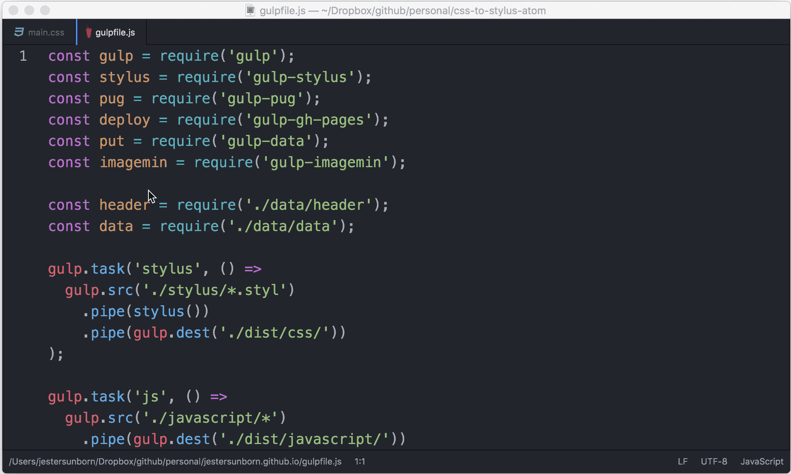

# css-to-stylus

> Atom package which convert your CSS to Stylus.

## Install

Run in your terminal app:

```
apm install css-to-stylus
```

Or install manualy:

`⌘+,` (or `Ctrl-,`) → _Install_ → `css-to-stylus`

## Usage

Select the content of a file:

* Right click > _Convert CSS to Stylus_
* Packages > _CSS to Stylus_ > _Convert CSS to Stylus_
* `⌘-⌥-o` (or `ctrl+alt+o`)

**Note:** Files, you're trying to convert, must have `.css` or `.styl` extension.

## Examples

<p align="center">
  
</p>

<p align="center">
  
</p>
